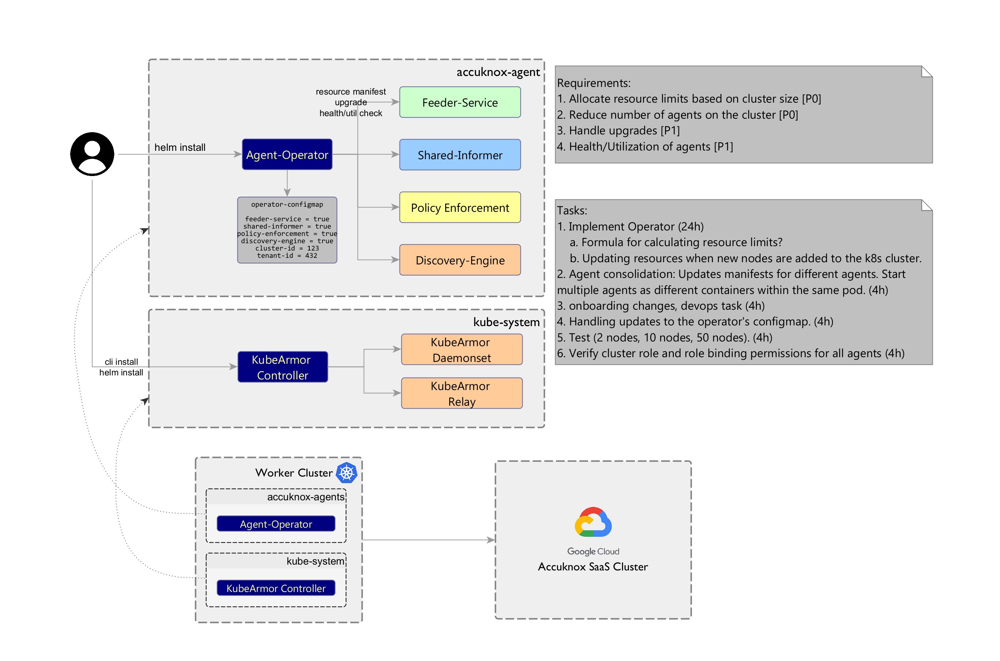

# Agents Operator

A Kubernetes Operator for Accuknox agents installation on the worker cluster.

## Description
Primary reason to have an operator:

Accuknox Agents manage synchronization to the Accuknox SaaS cluster. The agents resource limits are dependent on the worker cluster size. Without an operator, it is not possible to estimate the cluster size based on which to set the resource limits. The operator is responsible to spawn the agents depending on the cluster size. If the cluster size changes i.e, new nodes are added or existing nodes are deleted then the operator scales up/down the resources accordingly.



## Deploying

```
kubectl apply -f deployment/deployment.yaml
```
